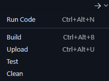

# Betriebshandbuch

## Inhaltsverzeichnis

- [Infrastruktur](#infrastruktur)
  - [Umgebung](#umgebung)
    - [Öffentliche Libraries](#öffentliche-libraries)
    - [Eigene Libraries](#eigene-libraries)
  - [Schnittstellen](#schnittstellen)
- [Installation](#installation)
  - [Extensions](#extensions)
  - [Konfiguration](#konfiguration)
- [Betrieb](#betrieb)
  - [Bedienung](#bedienung)
    - [Menü Wechsel](#menü-wechsel)
    - [Steurung des Timers](#steurung-des-timers)
  - [Häufige Fehler](#häufige-fehler)
- [Links](#links)
- [Glossar](#glossar)
- [Abbildungsverzeichnis](#abbildungsverzeichnis)
- [Quellen](#quellen)
- [Kontaktdaten](#kontaktdaten)

## Infrastruktur

### Umgebung

Das Projekt wurde in PlatformIO im Visual Studio Code umgesetzt mit folgenden Libraries:

#### Öffentliche Libraries

- **<Wire.h>**: Ermöglicht die Kommunikation mit I²C-Geräten.
- **<Arduino.h>**: Stellt grundlegende Arduino Funktionen wie pinMode bereit.
- **<SparkFun_ENS160>, <SparkfunBME280.h>**: Notwendig für die Verwaltung der gemessenen Daten des Environmental Combo Breakout.
- **<SerLCD.h>**: Bietet eine effiziente und einfache Lösung zur Anzeige.
- **<SparkFun_Qwiic_Buzzer_Arduino_Library.h>**: Notwendig für die Steuerung des Buzzers und fügt Beeps und Buzzes hinzu.
- **<SparkFun_Qwiic_Button.h>**: Entscheidet, ob der Knopf gedrückt wurde, und ermöglicht das Einstellen der Helligkeit der LEDs.
- **<SimpleSoftTimer.h>**: Einfache Timeout Verwaltung
- **<WiFiUdp.h>, <WiFi.h>**: Ermöglicht die Verbindung mit dem Internet.
- **<NTPClient.h>**: Ermöglicht den Abruf der Uhrzeit.

#### Eigene Libraries

- **<Buzzer.h>**: Beinhaltet Funktionen zum Buzzen des Buzzers bei bestimmten Bedingungen.
- **<Timer.h>**: Beinhaltet alle Funktionen für den Timer.
- **<LCD.h>**: Beinhaltet Funktionen für das Setup und die Anzeige des LCD's.
- **<Menu.h>**: Ermöglicht das Wechseln der Anzeige (Menü's).
- **<Network.h>**: Verbindet sich mit dem WLAN.
- **<Secrets.h>**: Beinhaltet SSID und Passwort des WLANs.

### Schnittstellen

Der NTPClient wird für die Anzeige der Uhrzeit und dem Datum verwendet.

## Installation

Um Probleme zu vermeiden, ist es empfehlenswert, das Projekt in [Visual Studio Code](https://code.visualstudio.com/download) mit [PlatformIO](https://platformio.org/install/ide?install=vscode) auszuführen.

### Extensions

- [PlatformIO IDE](https://marketplace.visualstudio.com/items?itemName=platformio.platformio-ide)
- [C/C++](https://marketplace.visualstudio.com/items?itemName=ms-vscode.cpptools)
- [C/C++ DevTools](https://marketplace.visualstudio.com/items?itemName=ms-vscode.cpp-devtools)
- [C/C++ Extension Pack](https://marketplace.visualstudio.com/items?itemName=ms-vscode.cpptools-extension-pack)
- [C/C++ Themes](https://marketplace.visualstudio.com/items?itemName=ms-vscode.cpptools-themes)

**Zwingend Herunterladen**

Lade den Ordner [SmartClock_Project](https://github.com/gbssg/ims.project.smartclock/tree/main/SmartClock_Project) vom Github herunter und öffne diesen mit PlatformIO. Darin befindet sich "main.cpp" im Ordner "src". Sobald diese Datei geöffnet ist, kann der Code Hochgeladen werden.



Es ist wichtig zu beachten, dass bei allen Komponenten das PWR-Licht leuchtet und das Mainboard via **USB-C** mit dem PC/Laptop verbunden ist.

### Konfiguration

Für die Verbindung mit dem WLAN sind die SSID und das Passwort notwendig. Dafür sollte im lib Ordner ein Ordner namens "secrets" erstellt werden mit einer "Secrets.h" Datei.

Der Inhalt sollte folgendermassen aussehen:

```c++
#pragma once

const char *WIFI_SSID = "DEIN SSID";

const char *WIFI_PASSWORD = "DEIN PASSWORD";
```

## Betrieb

### Bedienung

#### Menüwechsel

Nachdem der Code erfolgreich hochgeladen wurde, erscheint auf dem LCD die Anzeige mit dem Datum und der Uhrzeit. Die Anzeige (Menü) ändert sich automatisch alle 30 Sekunden, kann aber auch manuell mit einem Knopfdruck geändert werden.

#### Steuerung des Timers

Die Steuerung des Timers gelingt mit dem Joystick. Mit Hoch- oder Runterwischen wird die ausgewählte Zahl um 1 erhöht oder verringert. Mit Links- oder Rechtswischen kann man eine andere Ziffer auswählen. Die ausgewählte Ziffer wird mit dem Pfeil angezeigt. Der Timer startet, indem man mit dem Pfeil ganz nach links zum Startsymbol geht. Bei jeder Bewegung mit dem Joystick von dieser Position stoppt der Timer. Sobald der Timer endet, läutet der Buzzer, der ebenfalls mit einer Joystick Bewegung gestoppt werden kann.

### Häufige Fehler

- Fehlende Verbindung:  
  Es ist wichtig zu beachten, dass bei allen Komponenten das PWR Licht leuchtet. Dies stellt sicher, dass durch jedes Komponent Strom fliesst.
- Upload Fehler:
  ```console
  A fatal error occurred: Failed to connect to ESP32: Wrong boot mode detected (0x13)! The chip needs to be in download mode.
  *** [upload] Error 2
  ```
  Falls beim Hochladen dieser Fehler auftaucht, muss der boot Modus vom ESP32 geändert werden. Dazu muss während dem Hochladen, der Knopf "Boot" auf dem ATP Carrier Board geklickt werden.

## Links

- [Technische Dokumentation](./SmartClock_TechnischeDokumentation.md)
- [ReadMe](../README.md)

## Glossar

| Fachbegriff | Definition                            |
| ----------- | ------------------------------------- |
| I²C         | Kommunikationsbus                     |
| SSID        | Eindeutiger Name eines WLAN-Netzwerks |

## Abbildungsverzeichnis

- Abbildung 1: Upload auf das Mainboard

## Kontaktdaten

E-Mail: sai.ragavan412@gmail.com  
Github: [sai-412](https://github.com/sai-412)
