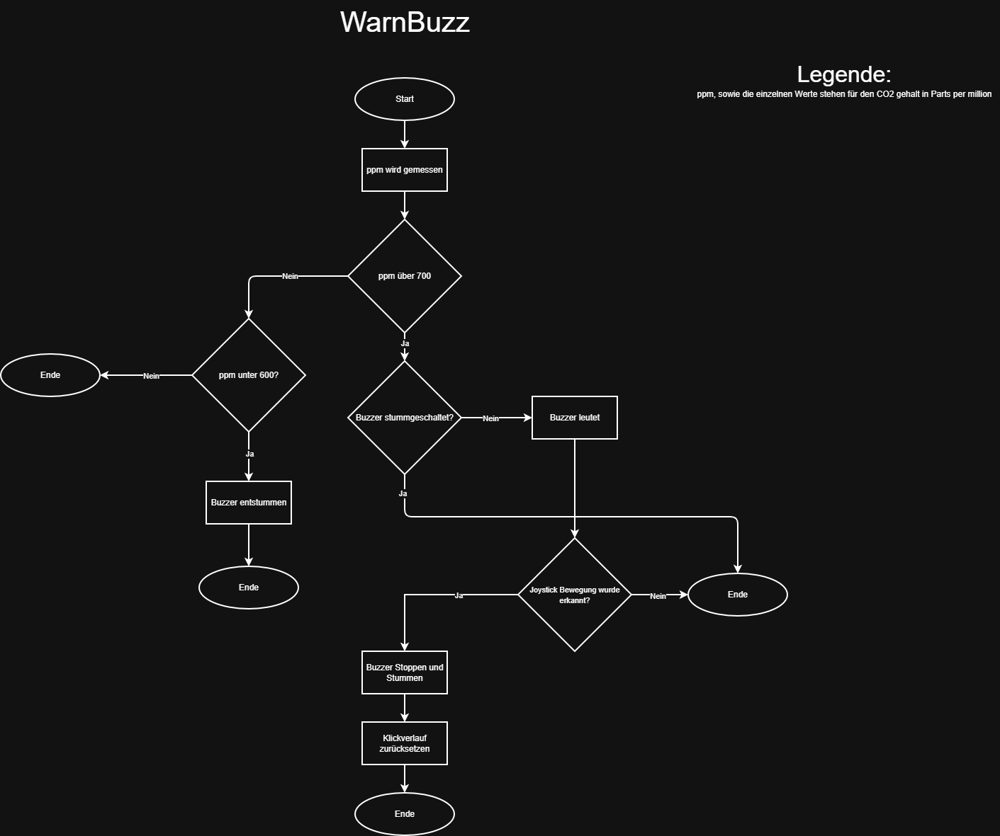

# Technische Dokumentation

## Projektstruktur

```
SmartClock_Project/
  ├── .pio/
  ├── .vscode/
  ├── include/
  ├── lib/
  │   ├── Buzzer/
  │   │   ├── Buzzer.cpp
  │   │   └── Buzzer.h
  │   ├── LCD/
  │   │   ├── LCD.cpp
  │   │   └── LCD.h
  │   ├── Menu/
  │   │   ├── Menu.cpp
  │   │   └── Menu.h
  │   ├── Netowrk/
  │   │   ├── Netowork.cpp
  │   │   └── Netowork.h
  │   ├── secrets/
  │   │   ├── secrets.h
  │   ├── Timer/
  │   │   ├── Timer.cpp
  │   │   └── Timer.h
  ├── src/
  │   └──main.cpp
  ├── include/
  ├── .gitignore
  └── platformio.ini
```

## Systemarchitektur

SmartClock besteht aus folgenden Komponenten:

- Mikrocontroller: SparkFun ESP32 MicroMod
- Anzeige: SerLCD
- Sensoren: SparkFun ENS160 und BME280
- Eingabe: Joystick und Qwiic Button
- Ausgabe: Qwiic Buzzer

Das Projekt ist wie folgt aufgebaut:

- src/main.cpp: Setup und Hauptschleife
- lib/LCD.cpp: Display Initialisierung und Anzeige
- lib/Network.cpp: WLAN- und NTPverbindung
- lib/Menu.cpp: Menüzustände mit Steuerung
- lib/Timer.cpp: Timereinstellung, Start / Stopp
- lib/Buzzer.cpp: Warn- und Timeralarme

## Hardware

### Pins und Verbindungen

- Joystick Y-Achse: A0
- Joystick X-Achse: A1

Der Joystick wird als Eingabe für die Menüsteuerung und Timerkonfiguration verwendet. Die ausgegebenen Werte vom Joystick, werden in Timer.cpp verarbeitet.

### Sensoren

- ENS160: CO2-Messung
- BME280: Temperaturmessung

Beide Sensoren kommunizieren über I2C.

### Anzeige

Das SerLCD kommuniziert mit I2C. Emojis werden beim Start mit lcd.createChar() geladen.

### Buzzer

Der Buzzer wird für die Luftqualitätswarnungen als auch beim Ende des Timers verwendet.

### Netzwerk

Die WLAN-Verbindung wird mit Network.cpp erstellt. Die benötigten Daten befinden sich in Secrets.h und werden nicht im Repository angezeigt.

## Programmablauf

### Setup

setup() initialisiert alle Komponente und konfiguriert Komponente:

1. Joystick-Pins als input einstellen
2. Serielle Schnittstelle starten
3. I2C starten
4. Timer initialisieren
5. WLAN Verbindung erstellen
6. NTP Client starten
7. Analoge Auflösung auf 7 Bit setzen
8. Komponente starten:  
   8.1 ens160.begin()  
   8.2 bme280.beginI2C()  
   8.3 buzzer.begin()  
   8.4 button.begin()
9. ENS160 in den Standardbetrieb setzen
10. LCD einrichten
11. Button LED ausschalten

Wenn ein Komponent nicht antwortet, wird dies im Serial Monitor ausgegeben und das Programm bleibt an dieser Stelle fest.

### Loop

loop() ist dafür zuständig, dass das Programm permanent aktualisiert wird:

1. Knopf LED steuern
2. Joystick Eingaben lesen
3. NTPZeit aktualisieren
4. CO2- und Temperaturwert mit einem Offset setzen:
   4.1 ppm = ens160.getECO2() + ppmDiff
   4.2 temp = bme280.readTempC() - tempDiff
5. Menü verwaltung
6. Luftbedingungen für das Buzzen prüfen
7. Timer starten / aktualisieren

## Display und Anzeige

### LCD.cpp

Die Anzeige benutzt selbstgemachte Zeichen und zwei Hauptanzeigen:

- printTimeAndDate() gibt die aktuelle Uhrzeit und das Datum aus.
- printTempAndCO2() gibt den CO2-Gehalt, Temperatur und ein Emoji entsprechend der Luftqualität aus.

### Sonderzeichen

Im Display werden folgende selbstgemachte Zeichen erstellt:

- Smiley
- Neutral
- Frownie
- Totenkopf
- Pfeil
- Startsymbol

### Aktualisierung der Anzeige

Die Anzeige wird mit Hilfe eines Timers, alle 50 ms aktualisiert.

## Menüverwaltung

### Menü Zustände

Das Menü hat drei Zustände:

- CLOCK_STATE: Uhrzeit & Datum
- AIR_QUALITY_STATE: CO2 und Temperatur
- TIMER_STATE: Timeranzeige und Einstellung

Der aktuelle Zustand wird in Menu.cpp verwaltet.

### Automatischer Wechsel

Mit changeMenuAutomatically() wechselt das Menü alle 30 Sekunden.

Die Reihenfolge ist wie folgt:

Uhrzeit → Luftqualität → Timer → Uhrzeit

Falls der Timer läuten sollte, wird automatisch der Timer dargestellt

### Knopfsteuerung

Das Menü kann mit einem Knopfdruck geändert werden. Die Funktionen handleMenuChange() und buttonReleaseHandler() sind dafür zuständig, dass jeder Klick nur einmal gezählt wird und nicht doppelt (Runter- und Hochdrücken).

### Display bereinigen

Die Funktion clearDisplayOnce() stellt sicher, dass beim Start nach einem Menü wechsel die Anzeige einmal gelöscht wird, Damit die letzte Anzeige nicht auf der aktuellen dargestellt wird.

### Menü Ausgaben

- CLOCK_STATE: printTimeAndDate()
- AIR_QUALITY_STATE: printTempAndCO2()
- TIMER_STATE: showTimer(), chooseOption() und setTimer()

## Timer funktionen

### Joystick eingaben

Die Timer Steuerung verwendet den Joystick für vier Richtungen:

- Rechts und links: Auswahl der Ziffer im Timer
- Hoch und runter: Werte ändern
- Position 1 (ganz links): Timer starten

### Anzeige des Timers

Der Timer wird als hh:mm:ss angezeigt. Ein Pfeil unter den Ziffern zeigt die ausgewählte Stelle. Dabei wird das : übersprungen.

### Auswahl der Ziffer

Die Funktion chooseOption() verschiebt den Pfeil zu den Ziffernpositionen.

### Werte setzen

Die Funktion setTimer() ändert die aktuelle Ziffer.

Die Werte haben folgende Maximalwerte:

- Stunde: 99
- Minuten und Sekunden: 59

### Start und Countdown

startTimer() zählt jede Sekunde herunter, sobald der Timer auf Position 1 ist.

Wenn der Timer abläuft, wird der Timeralarm gestartet.

- timerBuzz() aufrufen
- buzzerBuzzing = true
- currentState = TIMER_STATE

## Buzzer Logik



### Luftqualitätswarnung

Die Funktion warnBuzzAirQuality() prüft den CO2-Gehalt:

- ppm > midPPM (800): Alarm starten
- ppm >= highPPM (1000): verschiedener Alarm starten

Der Alarm stoppt bei einer Joystickbewegung.

### Timeralarm

timerBuzz() macht einen Alarm. Der Alarm wird gestoppt, sobald der Joystick bewegt wird. Dann werden timerHasStarted und buzzerBuzzing zurückgesetzt.

## Netzwerk und Zeit

### WLAN Verbindung

In Network.cpp wird WLAN mit WiFi.begin(WIFI_SSID, WIFI_PASSWORD) gestartet. Es wird bis zu 20 Mal versucht, eine Verbindung aufzubauen. Falls die Verbindung gelingt wird die lokale IP-Adresse und der Hostname ausgegeben.

### NTP-Zeit

Der NTPClient wird mit pool.ntp.org und einer Zeitzonenkorrektur von +3600 Sekunden eingestellt. Die Zeit wird mit timeClient.update() im loop aktualisiert.

### Secrets

Die Datei Secrets.h besitzt:

- WIFI_SSID
- WIFI_PASSWORD

Diese Datei ist nicht im Repository zu sehen.

## Konfiguration und Abhängigkeiten

### PlatformIO

Das Projekt wurde mit PlatformIO mit dem arduino Framework und dem Board sparkfun_esp32micromod erstellt.

### Bibliotheken

- Qwiic OLED
- SerLCD
- Qwiic Buzzer
- Qwiic Button
- ENS160
- BME280
- NTPClient
- SimpleSoftTimer

## Deployment

### Upload

Das Projekt wurde mit PlatformIO entwickelt und kann mit Alt + Ctrl + U auf das SparkFun ESP32 MicroMod hochgeladen werden.

### Updates

Änderungen werden im Repository gespeichert. Für Verbesserungen können neue Commits erstellt und mit Git synchronisiert werden.

## Verbesserungspotential

- Button und Joystick Eingaben regelmässiger erkennen
- TimerStatus anzeigen (z.B „laufender Timer“)
- Menünavigation verbessern (keine Doppelwechsel)
- Mehr Menüseiten (Anzeigen) für z.B Luftfeuchtigkeit

## Links

- [Zusammenfassung](./SmartClock_Zusammenfassung.md)
- [Betriebshandbuch](./SmartClock_Betriebshandbuch.md)

## Glossar

- NTP: Network Time Protocol
- PPM: Parts per Million, Messwert für CO2
- I2C: serielle Schnittstelle für Sensoren und Displays

## Abbildungsverzeichnis

## Quellen

- Projektcode im Ordner SmartClock_Project
- PlatformIO-Konfiguration in platformio.ini
- SparkFun Bibliotheken gemäss lib_deps
